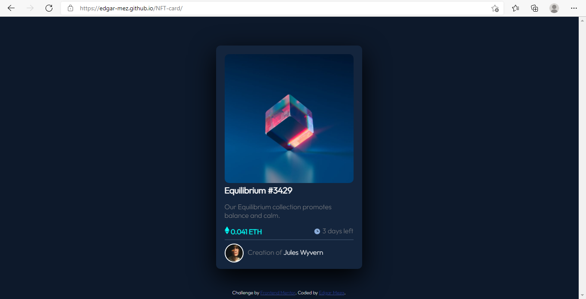

# Frontend Mentor - NFT preview card component solution

This is a solution to the [NFT preview card component challenge on Frontend Mentor](https://www.frontendmentor.io/challenges/nft-preview-card-component-SbdUL_w0U). Frontend Mentor challenges help you improve your coding skills by building realistic projects.

## Table of contents

- [Overview](#overview)
  - [The challenge](#the-challenge)
  - [Screenshot](#screenshot)
  - [Links](#links)
- [My process](#my-process)
  - [Built with](#built-with)
  - [What I learned](#what-i-learned)
  - [Continued development](#continued-development)
- [Author](#author)

**Note: Delete this note and update the table of contents based on what sections you keep.**

## Overview

### The challenge

Users should be able to:

- View the optimal layout depending on their device's screen size
- See hover states for interactive elements

### Screenshot

### Links

- Solution URL: [Add solution URL here](https://edgar-mez.github.io/NFT-card/)

## My process

### Built with

- Semantic HTML5 markup
- CSS custom properties

### What I learned

I reinforced knowledge of both HTML and CSS, Learning a little more about the application of some attributes and how they work on the website that is being developed.

### Continued development

I would like to work with the CSS framework tailwind with which I have not worked much but I find it interesting, for this challenge I planned to make use of some framework such as Reactjs, Bootstrap or tailwind but I preferred to test my skills without support from some framework or library.

## Author

- Website - Edgar Meza
- Frontend Mentor - [@Edgar-mez](https://www.frontendmentor.io/profile/Edgar-mez)
